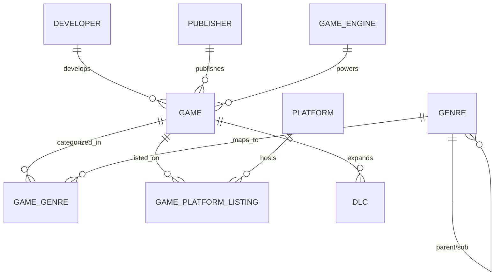

# 📚 Nexus Game Intelligence System - Technical Encyclopedia & Viva Guide

This document serves as your "cheat sheet" for the DBMS Final Project Evaluation. It covers everything from architectural decisions to SQL logic.

---

## 1. Project Overview & Problem Definition
**Problem Statement**: The gaming industry generates billions in data, but analyzing cross-platform performance, monetization trends, and engine efficiency is fragmented. 
**Solution**: Nexus is a centralized Intelligence System that tracks the lifecycle of a game—from its engine and development budget to its multi-platform revenue and DLC performance.

---

## 2. ER Diagram & Schema Design (Rubric #2)

### Normalization Logic (Rubric #3)
- **1NF**: Every column contains atomic values. No multi-valued attributes (e.g., Genres are in a separate table).
- **2NF**: All non-key attributes are fully functional dependent on the primary key. Bridge entities (`GameGenre`, `GamePlatformListing`) handle Many-to-Many relationships.
- **3NF**: Eliminated transitive dependencies. For example, Publisher Tiers are linked to the Publisher, not the Game.

---

## 3. Advanced SQL Implementation (Rubric #4)

### A. The Atomic Transaction (`RegisterGameComplete`)
**Viva Answer**: "I implemented a transaction to ensure **Data Integrity**. Registering a game requires entries in `Game`, `GameGenre`, and `GamePlatformListing`. If the platform listing fails, the `ROLLBACK` command ensures we don't have a game in the system without a price or platform."

### B. Scalar Function (`CalculateROI`)
**Viva Answer**: "This function encapsulates the business logic for calculating Return on Investment: `((Revenue - Budget) / Budget) * 100`. It makes the views cleaner and reusable."

### C. The Intelligence Views
- **GenrePerformance**: Uses `GROUP BY` and `AVG` to identify which genres are currently most profitable.
- **DLCMonetization**: Uses `LEFT JOIN` to ensure games without DLC still show up in the report with a `0` value.

---

## 4. Performance & Indexing (Rubric #3)
We have implemented **B-Tree Indexing** on:
1. `Game(title)`: For fast searching of specific titles.
2. `Game(release_date)`: To optimize time-series queries.
3. `Game(metacritic_score)`: For ranking and filtering high-quality titles.

---

## 5. ACID Properties in Nexus
- **Atomicity**: The `RegisterGameComplete` procedure is all-or-nothing.
- **Consistency**: Foreign keys ensure we can't add a game to a non-existent developer.
- **Isolation**: Stored procedures prevent partial data visibility during execution.
- **Durability**: Aiven Cloud MySQL ensures all `COMMIT`ed data is written to non-volatile storage.
